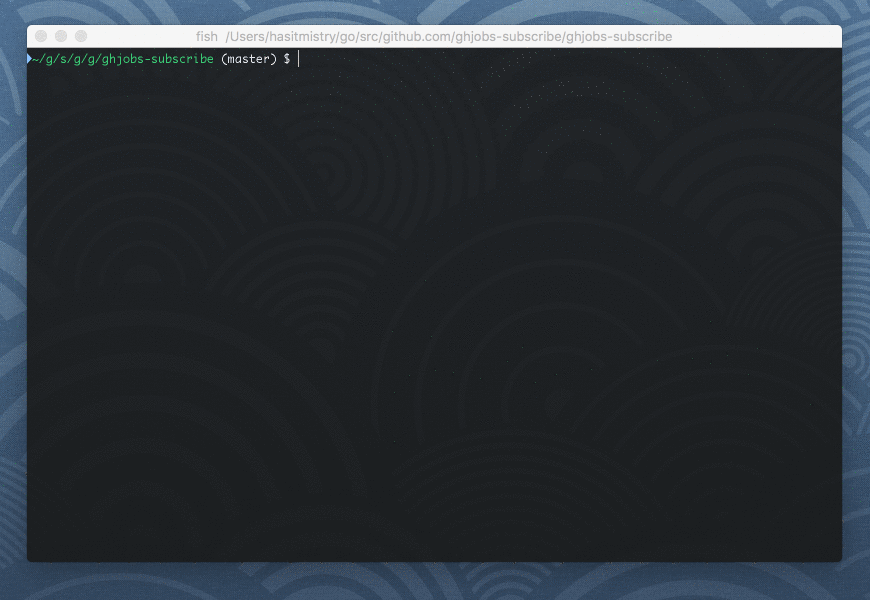

# bolter

View BoltDB file in your terminal



## Install

```
$ go get -u github.com/hasit/bolter
```

## Usage

```
$ bolter [global options]

GLOBAL OPTIONS:
  --file FILE, -f FILE        boltdb FILE to view
  --bucket BUCKET, -b BUCKET  boltdb BUCKET to view
  --machine, -m               key=value format
  --help, -h                  show help
  --version, -v               print the version
```

### List all buckets

```
$ bolter -f emails.db
+---------------------------+
|          BUCKETS          |
+---------------------------+
| john@doe.com              |
| jane@roe.com              |
| sample@example.com        |
| test@test.com             |
+---------------------------+
```

### List all items in bucket

```
$ bolter -f emails.db -b john@doe.com
Bucket: john@doe.com
+---------------+---------------------+
|      KEY      |        VALUE        |
+---------------+---------------------+
| emailLastSent |                     |
| subLocation   |                     |
| subTag        |                     |
| userActive    | true                |
| userCreatedOn | 2016-10-28 07:21:49 |
| userEmail     | john@doe.com        |
| userFirstName | John                |
| userLastName  | Doe                 |
+---------------+---------------------+
```

### Nested buckets

You can easily list all items in a nested bucket:

```
$ bolter -f my.db
+-----------+
|  BUCKETS  |
+-----------+
|   root    |
+-----------+

$ bolter -f my.db -b root
Bucket: root
+---------+---------+
|   KEY   |  VALUE  |
+---------+---------+
| nested* |         |
+---------+---------+

* means the key ('nested' in this case) is a bucket.

$ bolter -f my.db -b root.nested
Bucket: root.nested
+---------+---------+
|   KEY   |  VALUE  |
+---------+---------+
|  mykey  | myvalue |
+---------+---------+
```

### Machine friendly output

```
$ bolter -f emails.db -m
john@doe.com
jane@roe.com
sample@example.com
test@test.com

$ bolter -f emails.db -b john@doe.com -m
emailLastSent=
subLocation=
subTag=
userActive=true
userCreatedOn=2016-10-28 07:21:49
userEmail=john@doe.com
userFirstName=John
userLastName=Doe
nested-bucket*=
```

## Contribute

Feel free to ask questions, post issues and open pull requests. My only requirement is that you run `gofmt` on your code before you send in a PR.
