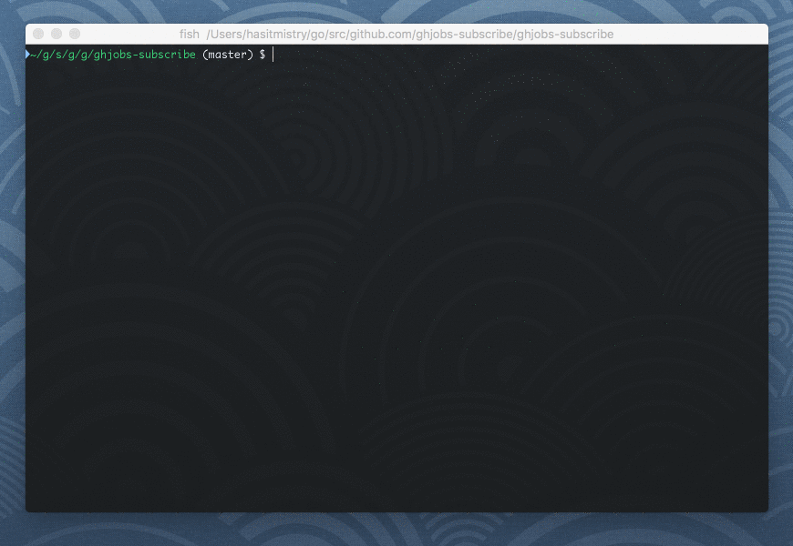

# bolter

View BoltDB file in your terminal

## Install

```
$ go get -u github.com/hasit/bolter
```

## Usage

```
NAME:
  bolter - view boltdb file in your terminal

VERSION:
  1.0.0

USAGE:
  bolter [global options]

GLOBAL OPTIONS:
  --file FILE, -f FILE		boltdb FILE to view
  --bucket BUCKET, -b BUCKET	boltdb BUCKET to view
  --help, -h			show help
  --version, -v			print the version

AUTHOR:
  Hasit Mistry <hasitnm@gmail.com>
```

### List all buckets



### List all items in bucket


#### Nested buckets

You can easily list all items in a nested bucket:
```
$ bolter -f my.db
+-----------+
|  BUCKETS  |
+-----------+
|   root    |
+-----------+

$ bolter -f my.db -b root
Bucket: root
+---------+---------+
|   KEY   |  VALUE  |
+---------+---------+
| nested* |         |
+---------+---------+
```

***** means `nested` is a bucket.

```
$ bolter -f my.db -b root.nested
Bucket: root.nested
+---------+---------+
|   KEY   |  VALUE  |
+---------+---------+
|  mykey  | myvalue |
+---------+---------+
```

## Contribute

Feel free to ask questions, post issues and open pull requests. My only requirement is that you run `gofmt` on your code before you send in a PR.
